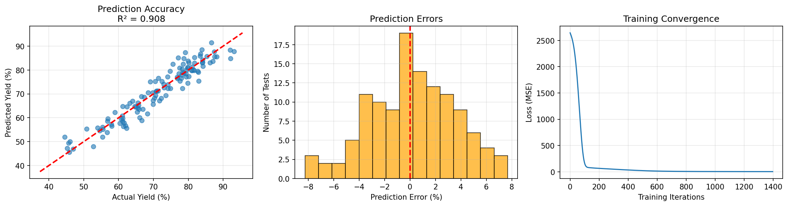

# Chemical Reaction Optimization using Neural Networks

## Reaction System
**Esterification Reaction**  
Acid + Alcohol → Ester + Water  

---

## Dataset Overview

- Number of simulated experiments: **600**
- Average yield: **72.11%**
- Yield range: **37.46% – 95.55%**

Synthetic data was generated to reflect realistic chemical relationships between operating parameters and yield behavior.

---

## Model Training

A neural network was trained to predict ester yield based on the reaction parameters.

### Performance Metrics

| Metric | Training | Test |
|--------|----------|------|
| R² Score | 0.9392 | 0.9085 |
| MSE | 7.59 | 11.76 |
| RMSE | 2.75 | 3.43 |

---

## Model Interpretation

- The model explains **90.85% of yield variation** on unseen test data.
- Typical prediction deviation: **±3.43 percentage points**
- Average prediction error: **2.7%**

The close alignment between training and test performance indicates appreciable generalization without much overfitting.

---

## Optimization Results

A parameter search was performed using the trained model to identify optimal reaction conditions.

### Optimal Conditions Identified

- **Temperature:** 113.5°C  
- **Catalyst Loading:** 2.62%  
- **Reaction Time:** 7.9 hours  
- **Acid:Alcohol Ratio:** 1.07  
- **Agitation Speed:** 762 RPM  
- **Expected Yield:** 93.9%

---

## Model Performance Visualization

The figure below compares predicted vs actual yield and illustrates model fit quality.

---

## Conclusion

The neural network successfully models esterification yield behavior and demonstrates potential as a predictive decision-support tool for reaction optimization.
